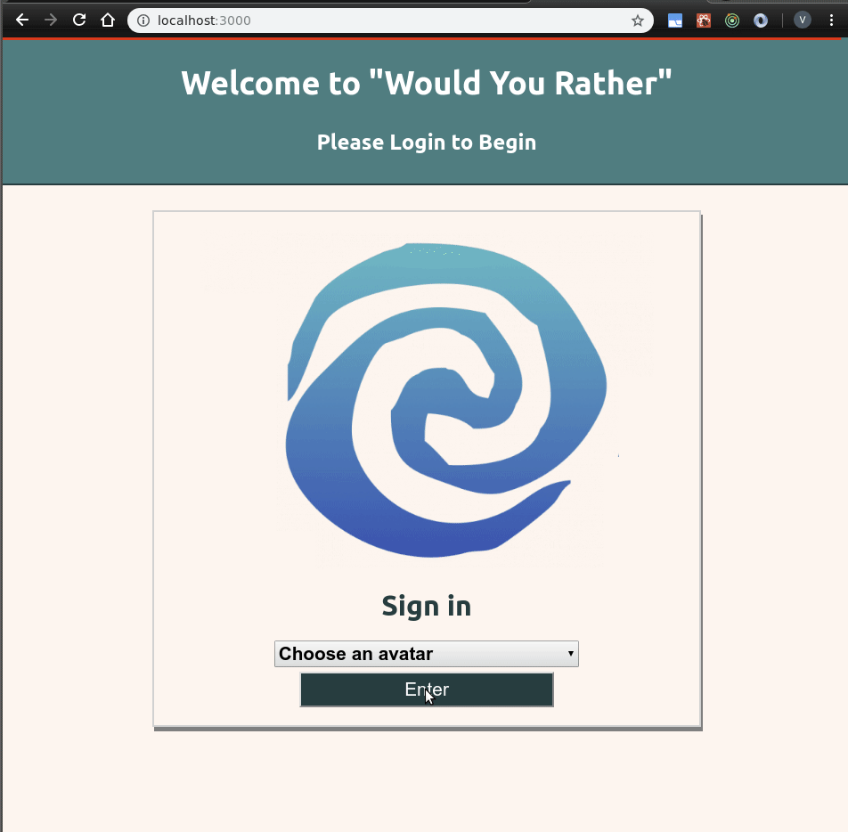

# Project Overview

In the "Would You Rather?" Project, I've built a web app that lets a user play the “Would You Rather?” game. The game goes like this: A user is asked a question in the form: “Would you rather [option A] or [option B] ?”. Answering "neither" or "both" is against the rules.

In this app, users will be able to:
 - answer questions
 - see which questions they haven’t answered
 - see how other people have voted, post questions
 - see the ranking of users on the leaderboard

# How to run this project:

- Download the files
- run `npm install` to download the dependencies
- run `npm start` to run the application. The applicaiton will open automatically in the browser.

NOTE: You need to have `npm` installed on your machine. Click [here](https://docs.npmjs.com/downloading-and-installing-node-js-and-npm) to go to the official downloading site.

# Sample

